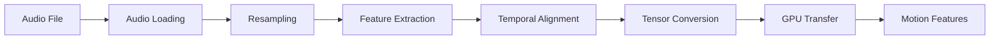

# Architecture Documentation

Comprehensive technical overview of Visualizr's architecture, AI models, and system
design.

## Table of Contents

- [System Overview](#system-overview)
- [Core Architecture](#core-architecture)
- [AI Models](#ai-models)
- [Data Flow](#data-flow)
- [Processing Pipeline](#processing-pipeline)
- [Model Components](#model-components)
- [Performance Considerations](#performance-considerations)
- [Extensibility](#extensibility)

## System Overview

Visualizr is a sophisticated AI-powered video generation system that transforms static
portrait images into animated talking avatars synchronized with audio input. The system
combines multiple state-of-the-art deep learning techniques including diffusion models,
neural audio processing, and facial animation.

### High-Level Architecture

```mermaid
graph TB
    A[User Input] --> B[Web Interface/API]
    B --> C[Application Layer]
    C --> D[AniTalker Core]
    D --> E[Audio Processing]
    D --> F[Image Processing] 
    D --> G[Video Generation]
    E --> H[MFCC/HuBERT Features]
    F --> I[LiaModel Stage 1]
    G --> J[Diffusion Model Stage 2]
    H --> K[Motion Generation]
    I --> K
    J --> K
    K --> L[Frame Renderer]
    L --> M[Video Assembly]
    M --> N[Super Resolution (Optional)]
    N --> O[Output Video]
```

### Key Components

1. **Web Interface**: Gradio-based user interface and REST API
2. **Application Layer**: Python application logic and configuration
3. **AniTalker Core**: Main AI engine for video generation
4. **Audio Processing**: Feature extraction from speech audio
5. **Image Processing**: Portrait analysis and encoding
6. **Motion Generation**: Diffusion-based facial animation
7. **Rendering Pipeline**: Frame-by-frame video generation
8. **Post-Processing**: Optional super-resolution enhancement

## Core Architecture

### System Layers

#### 1. Interface Layer

**Web Interface (Gradio)**

- User-friendly GUI for file uploads and parameter control
- Real-time preview and progress monitoring
- RESTful API endpoints for programmatic access
- File management and result delivery

**Components:**

- `visualizr.app.builder.App.gui()`: Main interface constructor
- `visualizr.app.runner`: Application runner and server
- Gradio Blocks: Interactive components and layouts

#### 2. Application Layer

**Configuration Management**

- Environment-based settings with Pydantic validation
- Directory structure management
- Model parameter configuration
- Hardware detection and optimization

**Components:**

- `visualizr.settings.Settings`: Main configuration class
- `visualizr.settings.ModelSettings`: AI model parameters
- `visualizr.settings.DirectorySettings`: File system paths

#### 3. AI Engine Layer

**AniTalker Architecture**

- Two-stage generation pipeline
- Stage 1: Identity encoding and feature extraction
- Stage 2: Motion synthesis and temporal consistency

**Components:**

- `visualizr.anitalker.liamodel.LiaModel`: Stage 1 encoder
- `visualizr.anitalker.experiment`: Stage 2 diffusion model
- `visualizr.anitalker.renderer`: Video frame generation

#### 4. Data Processing Layer

**Audio Processing**

- MFCC (Mel-frequency cepstral coefficients) extraction
- HuBERT (Hidden-Unit BERT) feature extraction
- Audio-visual synchronization
- Temporal alignment and preprocessing

**Image Processing**

- Portrait detection and cropping
- Facial landmark extraction
- Identity encoding and style transfer
- Multi-resolution processing

### Technology Stack

**Core Technologies:**

- **Python 3.10**: Main application language
- **PyTorch**: Deep learning framework
- **Gradio**: Web interface and API framework
- **Pydantic**: Configuration and data validation

**AI/ML Libraries:**

- **ESPnet**: Speech processing toolkit
- **Transformers**: HuBERT model implementation
- **PyTorch Lightning**: Training and model management
- **RealESRGAN**: Super-resolution enhancement

**Supporting Libraries:**

- **MoviePy**: Video processing and assembly
- **NumPy**: Numerical computing
- **Librosa**: Audio analysis and processing
- **Hugging Face Hub**: Model distribution and caching

## AI Models

### AniTalker Architecture

AniTalker is the core AI system that powers Visualizr's video generation capabilities.

#### Stage 1: Identity Encoding (LiaModel)

**Purpose**: Extract identity features from the input portrait image.

**Architecture:**

```python
class LiaModel(nn.Module):
    def __init__(self, motion_dim=20, fusion_type="weighted_sum"):
        # Identity encoder network
        self.encoder = IdentityEncoder()
        # Motion decoder network  
        self.decoder = MotionDecoder(motion_dim)
        # Feature fusion mechanism
        self.fusion = FusionLayer(fusion_type)
```

**Key Features:**

- **Identity Preservation**: Maintains person-specific features
- **Expression Disentanglement**: Separates identity from expressions
- **Multi-scale Processing**: Handles various image resolutions
- **Style Consistency**: Ensures consistent visual style

**Input/Output:**

- **Input**: Portrait image (256x256 or 512x512)
- **Output**: Identity features, directional codes, facial features

#### Stage 2: Motion Synthesis (Diffusion Model)

**Purpose**: Generate temporal facial motions synchronized with audio.

**Architecture:**

- **U-Net Backbone**: Modified U-Net for motion generation
- **Attention Mechanisms**: Cross-attention for audio-visual alignment
- **Diffusion Process**: Denoising diffusion for high-quality generation
- **Temporal Consistency**: Ensures smooth frame-to-frame transitions

**Model Variants:**

1. **BeatGANs UNet** (`BeatGANsUNetConfig`)
    - Advanced GAN-based architecture
    - High-quality image generation
    - Stable training dynamics

2. **BeatGANs Autoencoder** (`BeatGANsAutoencConfig`)
    - Encoder-decoder architecture
    - Latent space manipulation
    - Controllable generation

**Key Parameters:**

```python
TrainConfig(
    model_type=ModelType.autoencoder,
    T=1000,                    # Diffusion steps
    beta_scheduler="linear",   # Noise schedule
    img_size=256,             # Image resolution
    motion_dim=20,            # Motion space dimension
    decoder_layers=2          # Decoder complexity
)
```

### Audio Processing Models

#### MFCC-Based Processing

**Mel-Frequency Cepstral Coefficients (MFCC)**

- **Purpose**: Extract acoustic features from speech audio
- **Components**: 13 MFCC coefficients + delta + delta-delta features
- **Frame Rate**: 100Hz (4x video frame rate for 25fps)
- **Advantages**: Fast processing, proven effectiveness
- **Use Cases**: Real-time applications, resource-constrained environments

**Processing Pipeline:**

```python
def extract_mfcc_features(audio_path, sr=16000):
    # Load audio
    wav, sr = librosa.load(audio_path, sr=sr)
    
    # Extract MFCC features
    mfcc_features = mfcc(wav, sr)
    
    # Add delta features
    delta_features = delta(mfcc_features, 1)
    delta2_features = delta(mfcc_features, 2)
    
    # Combine features
    audio_features = np.hstack([
        mfcc_features, delta_features, delta2_features
    ])
    
    return audio_features
```

#### HuBERT-Based Processing

**Hidden-Unit BERT (HuBERT)**

- **Purpose**: Extract semantic audio representations
- **Architecture**: Transformer-based audio model
- **Frame Rate**: 50Hz (2x video frame rate for 25fps)
- **Advantages**: Better semantic understanding, natural expressions
- **Use Cases**: High-quality generation, natural speech patterns

**Model Details:**

- **Base Model**: `chinese-hubert-large`
- **Hidden States**: 24 layers of 1024-dimensional features
- **Processing**: Self-supervised audio representation learning
- **Alignment**: Automatic audio-video temporal alignment

**Processing Pipeline:**

```python
def extract_hubert_features(audio_path):
    # Load HuBERT model
    model = HubertModel.from_pretrained("ckpts/chinese-hubert-large")
    feature_extractor = Wav2Vec2FeatureExtractor.from_pretrained(
        "ckpts/chinese-hubert-large"
    )
    
    # Process audio
    audio, sr = librosa.load(audio_path, sr=16000)
    input_values = feature_extractor(
        audio, sampling_rate=16000, return_tensors="pt"
    ).input_values
    
    # Extract features
    with torch.no_grad():
        outputs = model(input_values, output_hidden_states=True)
        hidden_states = outputs.hidden_states
        
    return hidden_states
```

### Diffusion Model Details

#### Denoising Diffusion Process

**Forward Process (Noise Addition):**

- Gradually add Gaussian noise to motion data
- Noise schedule: Linear or cosine scheduling
- Time steps: 1000 steps for training, configurable for inference

**Reverse Process (Denoising):**

- Learn to predict and remove noise at each timestep
- Conditional on audio features and identity codes
- Generate smooth temporal motions

**Mathematical Foundation:**

```
q(x_t|x_{t-1}) = N(x_t; √(1-β_t)x_{t-1}, β_t I)
p_θ(x_{t-1}|x_t) = N(x_{t-1}; μ_θ(x_t,t), Σ_θ(x_t,t))
```

Where:

- `x_t`: Motion state at timestep t
- `β_t`: Noise variance at timestep t
- `μ_θ, Σ_θ`: Predicted mean and variance

#### Sampling Strategies

**DDPM (Denoising Diffusion Probabilistic Models):**

- Full denoising process
- High quality but slower
- Best for final generation

**DDIM (Denoising Diffusion Implicit Models):**

- Accelerated sampling
- Deterministic process
- Good quality-speed tradeoff

```python
# DDIM sampling configuration
SpacedDiffusionBeatGansConfig(
    gen_type=GenerativeType.ddim,
    use_timesteps=space_timesteps(1000, "ddim50"),  # 50 steps
    model_mean_type=ModelMeanType.eps,
    model_var_type=ModelVarType.fixed_large
)
```

## Data Flow

### Input Processing Pipeline

#### 1. Image Processing Flow


**Steps:**

1. **Image Loading**: Read and validate image file
2. **Resolution Check**: Ensure minimum 256x256 resolution
3. **Preprocessing**: Normalize, crop, and resize
4. **Tensor Conversion**: Convert to PyTorch tensors
5. **GPU Transfer**: Move to CUDA device if available
6. **Identity Encoding**: Extract person-specific features
7. **Feature Extraction**: Generate facial landmarks and features
8. **Style Codes**: Create identity and direction codes

#### 2. Audio Processing Flow



**Steps:**

1. **Audio Loading**: Load and validate audio file
2. **Resampling**: Convert to 16kHz sample rate
3. **Feature Extraction**: MFCC or HuBERT processing
4. **Temporal Alignment**: Align with video frame rate
5. **Tensor Conversion**: Convert to PyTorch tensors
6. **GPU Transfer**: Move to CUDA device
7. **Motion Features**: Ready for motion synthesis

### Generation Pipeline

#### Phase 1: Model Loading and Initialization

```python
def initialize_models():
    # Stage 1: Identity encoder
    lia_model = LiaModel(motion_dim=20, fusion_type="weighted_sum")
    lia_model.load_lightning_model("ckpts/stage1.ckpt")
    lia_model.to("cuda")
    
    # Stage 2: Motion synthesizer
    config = TrainConfig(infer_type="hubert_audio_only")
    motion_model = load_stage_2_model(
        config, "ckpts/stage2_audio_only_hubert.ckpt"
    )
    
    return lia_model, motion_model
```

#### Phase 2: Feature Extraction

```python
def extract_features(image_tensor, audio_features):
    # Identity and style extraction
    start_code, direction_code, face_features = lia_model.get_start_direction_code(
        image_tensor, image_tensor, image_tensor, image_tensor
    )
    
    # Control signals
    pose_signals = create_pose_signals(frame_count, pose_params)
    face_signals = create_face_signals(frame_count, face_params)
    
    return start_code, direction_code, face_features, pose_signals, face_signals
```

#### Phase 3: Motion Generation

```python
def generate_motions(audio_features, control_signals, diffusion_steps):
    # Diffusion noise initialization
    noise = torch.randn((1, frame_count, motion_dim)).to("cuda")
    
    # Diffusion denoising process
    generated_directions = motion_model.render(
        start_code,
        direction_code, 
        audio_features,
        face_location_signal,
        face_scale_signal,
        pose_signal,
        noise,
        diffusion_steps,
        use_ddim=True
    )
    
    return generated_directions
```

#### Phase 4: Frame Rendering

```python
def render_frames(generated_directions, lia_model, face_features):
    frames = []
    
    for frame_idx in range(generated_directions.shape[1]):
        # Extract motion for current frame
        motion_vector = generated_directions[:, frame_idx, :]
        
        # Render frame
        rendered_frame = lia_model.render(
            start_code,
            motion_vector.to("cuda"),
            face_features
        )
        
        # Post-process frame
        frame = (rendered_frame.detach() + 1) / 2  # Denormalize
        frames.append(frame)
    
    return frames
```

#### Phase 5: Video Assembly

```python
def assemble_video(frames, audio_path, output_path):
    # Save frames as images
    frame_paths = save_frames_to_disk(frames)
    
    # Create video with audio
    frames_to_video(
        frame_directory=frame_paths,
        audio_file=audio_path,
        output_file=output_path,
        fps=25
    )
    
    # Optional super-resolution
    if enable_super_resolution:
        enhanced_path = apply_super_resolution(output_path)
        return output_path, enhanced_path
    
    return output_path, None
```

## Processing Pipeline

### Inference Types and Pipelines

#### 1. MFCC Full Control Pipeline

```python
def mfcc_full_control_pipeline(image, audio, control_params):
    # MFCC feature extraction
    audio_features = extract_mfcc_with_deltas(audio)  # 39-dim features
    
    # Identity encoding
    identity_codes = encode_identity(image)
    
    # Control signal preparation  
    pose_signals = prepare_pose_controls(control_params)
    face_signals = prepare_face_controls(control_params)
    
    # Motion synthesis with full control
    motions = synthesize_motions(
        audio_features, identity_codes, pose_signals, face_signals
    )
    
    # Frame rendering
    frames = render_frames(motions, identity_codes)
    
    return frames
```

#### 2. HuBERT Audio-Only Pipeline

```python
def hubert_audio_only_pipeline(image, audio):
    # HuBERT feature extraction
    hubert_features = extract_hubert_features(audio)  # Multi-layer features
    
    # Identity encoding
    identity_codes = encode_identity(image)
    
    # Audio-driven motion synthesis (no manual control)
    motions = synthesize_audio_driven_motions(hubert_features, identity_codes)
    
    # Frame rendering
    frames = render_frames(motions, identity_codes)
    
    return frames
```

### Super-Resolution Pipeline

**RealESRGAN Enhancement**

- **Purpose**: Upscale 256x256 output to 512x512
- **Model**: RealESRGAN face enhancement model
- **Processing**: Per-frame enhancement with temporal consistency
- **Quality**: Significantly improved detail and sharpness

```python
def apply_super_resolution(input_video, output_video):
    # Load RealESRGAN model
    enhancer = RealESRGANer(
        scale=2,
        model_path="weights/RealESRGAN_x2plus.pth",
        model=RRDBNet(num_in_ch=3, num_out_ch=3, num_feat=64),
        tile=0,
        tile_pad=10,
        pre_pad=0,
        half=True  # FP16 for speed
    )
    
    # Process video frame by frame
    enhanced_frames = []
    for frame in extract_frames(input_video):
        enhanced_frame = enhancer.enhance(frame, outscale=2)
        enhanced_frames.append(enhanced_frame)
    
    # Reassemble video
    assemble_video(enhanced_frames, output_video)
```

## Model Components

### Core Neural Network Modules

#### 1. Identity Encoder

**Purpose**: Extract person-specific features from portrait images

**Architecture:**

```python
class IdentityEncoder(nn.Module):
    def __init__(self):
        self.backbone = ResNetBackbone(layers=[3, 4, 6, 3])
        self.feature_extractor = FeatureExtractor(dim=512)
        self.style_encoder = StyleEncoder(style_dim=512)
    
    def forward(self, x):
        features = self.backbone(x)
        identity_features = self.feature_extractor(features)
        style_codes = self.style_encoder(identity_features)
        return identity_features, style_codes
```

**Key Features:**

- **Multi-scale Processing**: Captures features at different resolutions
- **Identity Disentanglement**: Separates identity from expressions
- **Style Consistency**: Maintains consistent visual appearance

#### 2. Motion Decoder

**Purpose**: Generate facial motions from audio and control inputs

**Architecture:**

```python
class MotionDecoder(nn.Module):
    def __init__(self, motion_dim=20):
        self.audio_encoder = AudioEncoder()
        self.control_encoder = ControlEncoder()
        self.motion_generator = MotionGenerator(motion_dim)
        self.temporal_consistency = TemporalConsistency()
    
    def forward(self, audio_features, control_signals):
        audio_encoding = self.audio_encoder(audio_features)
        control_encoding = self.control_encoder(control_signals)
        
        combined_features = torch.cat([audio_encoding, control_encoding], dim=-1)
        motions = self.motion_generator(combined_features)
        
        # Ensure temporal smoothness
        smooth_motions = self.temporal_consistency(motions)
        return smooth_motions
```

#### 3. Diffusion U-Net

**Purpose**: Denoise motion sequences during generation

**Architecture:**

- **Encoder Path**: Downsampling with attention layers
- **Bottleneck**: Cross-attention for audio conditioning
- **Decoder Path**: Upsampling with skip connections
- **Time Embedding**: Sinusoidal position embeddings for diffusion timesteps

```python
class DiffusionUNet(nn.Module):
    def __init__(self, motion_dim=20, audio_dim=768):
        # Time embedding
        self.time_embed = nn.Sequential(
            SinusoidalPositionEmbedding(128),
            nn.Linear(128, 512),
            nn.SiLU(),
            nn.Linear(512, 512)
        )
        
        # Encoder blocks
        self.encoder_blocks = nn.ModuleList([
            UNetBlock(motion_dim, 128, time_dim=512),
            UNetBlock(128, 256, time_dim=512),
            UNetBlock(256, 512, time_dim=512)
        ])
        
        # Cross-attention for audio conditioning
        self.cross_attention = CrossAttention(512, audio_dim)
        
        # Decoder blocks with skip connections
        self.decoder_blocks = nn.ModuleList([
            UNetBlock(512 + 512, 256, time_dim=512),
            UNetBlock(256 + 256, 128, time_dim=512), 
            UNetBlock(128 + 128, motion_dim, time_dim=512)
        ])
```

#### 4. Feature Fusion Networks

**Purpose**: Combine features from different modalities

**Types:**

- **Weighted Sum**: Simple linear combination
- **Attention-based**: Learned attention weights
- **Multi-modal**: Complex cross-modal interactions

```python
class FeatureFusion(nn.Module):
    def __init__(self, fusion_type="weighted_sum"):
        self.fusion_type = fusion_type
        
        if fusion_type == "attention":
            self.attention = MultiHeadAttention(embed_dim=512)
        elif fusion_type == "multimodal":
            self.fusion_network = MultiModalFusion()
    
    def forward(self, audio_features, visual_features):
        if self.fusion_type == "weighted_sum":
            return audio_features + visual_features
        elif self.fusion_type == "attention":
            fused, _ = self.attention(
                query=audio_features,
                key=visual_features,
                value=visual_features
            )
            return fused
        else:
            return self.fusion_network(audio_features, visual_features)
```

### Loss Functions and Training Objectives

#### 1. Reconstruction Loss

```python
def reconstruction_loss(generated_frames, target_frames):
    # L1 loss for pixel-level accuracy
    l1_loss = F.l1_loss(generated_frames, target_frames)
    
    # Perceptual loss using pre-trained VGG features
    perceptual_loss = perceptual_distance(generated_frames, target_frames)
    
    return l1_loss + 0.1 * perceptual_loss
```

#### 2. Temporal Consistency Loss

```python
def temporal_consistency_loss(frame_sequence):
    # Ensure smooth transitions between frames
    temporal_diff = frame_sequence[:, 1:] - frame_sequence[:, :-1]
    return torch.mean(torch.abs(temporal_diff))
```

#### 3. Identity Preservation Loss

```python
def identity_preservation_loss(generated_frames, source_image):
    # Use pre-trained face recognition model
    source_identity = face_encoder(source_image)
    generated_identities = face_encoder(generated_frames)
    
    # Cosine similarity loss
    similarity = F.cosine_similarity(
        source_identity.unsqueeze(1).expand_as(generated_identities),
        generated_identities
    )
    
    return 1 - similarity.mean()
```

## Performance Considerations

### Memory Management

#### GPU Memory Optimization

**Techniques Used:**

1. **Gradient Checkpointing**: Trade compute for memory
2. **Mixed Precision (FP16)**: Reduce memory footprint by 50%
3. **Model Sharding**: Load models on-demand
4. **Batch Size Optimization**: Dynamic batch sizing based on available memory

```python
def optimize_memory_usage():
    # Enable gradient checkpointing
    model.gradient_checkpointing_enable()
    
    # Use automatic mixed precision
    scaler = torch.cuda.amp.GradScaler()
    
    # Monitor GPU memory
    if torch.cuda.memory_allocated() > 0.8 * torch.cuda.max_memory_allocated():
        torch.cuda.empty_cache()
        # Fallback to CPU if needed
        model.to('cpu')
```

#### Memory Requirements by Configuration

| Configuration           | GPU Memory | System RAM | Processing Time |
|-------------------------|------------|------------|-----------------|
| CPU Only                | 0GB        | 8GB        | 5-10 minutes    |
| CUDA (Basic)            | 4-6GB      | 8GB        | 1-3 minutes     |
| CUDA (High Quality)     | 6-8GB      | 16GB       | 2-5 minutes     |
| CUDA (Super-Resolution) | 8-12GB     | 16GB       | 3-7 minutes     |

### Computational Complexity

#### Time Complexity Analysis

**Stage 1 (Identity Encoding):**

- **Complexity**: O(H×W×C) where H×W is image resolution, C is channels
- **Typical**: O(256×256×3) = O(196K) operations
- **Time**: ~0.1-0.5 seconds on GPU

**Stage 2 (Motion Generation):**

- **Complexity**: O(T×D×S) where T is frames, D is motion dimension, S is diffusion
  steps
- **Typical**: O(100×20×50) = O(100K) operations per generation
- **Time**: ~10-60 seconds depending on steps and hardware

**Frame Rendering:**

- **Complexity**: O(T×H×W×C) for T frames
- **Typical**: O(100×256×256×3) = O(19.6M) operations
- **Time**: ~5-20 seconds depending on hardware

### Optimization Strategies

#### 1. Model Optimization

**Quantization:**

```python
def quantize_model(model):
    # Post-training quantization
    quantized_model = torch.quantization.quantize_dynamic(
        model, {torch.nn.Linear}, dtype=torch.qint8
    )
    return quantized_model
```

**Knowledge Distillation:**

```python
def distill_model(teacher_model, student_model, data_loader):
    # Train smaller student model to mimic teacher
    for batch in data_loader:
        teacher_output = teacher_model(batch)
        student_output = student_model(batch)
        
        # Distillation loss
        loss = F.kl_div(
            F.log_softmax(student_output / temperature, dim=1),
            F.softmax(teacher_output / temperature, dim=1)
        )
```

#### 2. Inference Optimization

**Caching Strategies:**

```python
class ModelCache:
    def __init__(self):
        self.identity_cache = {}
        self.audio_cache = {}
    
    def get_or_compute_identity(self, image_hash, image_tensor):
        if image_hash in self.identity_cache:
            return self.identity_cache[image_hash]
        
        identity_features = self.identity_encoder(image_tensor)
        self.identity_cache[image_hash] = identity_features
        return identity_features
```

**Batch Processing:**

```python
def batch_process_videos(requests, batch_size=4):
    # Group requests by similar parameters
    grouped_requests = group_by_parameters(requests)
    
    results = []
    for group in grouped_requests:
        # Process in batches
        for i in range(0, len(group), batch_size):
            batch = group[i:i+batch_size]
            batch_results = model.forward_batch(batch)
            results.extend(batch_results)
    
    return results
```

## Extensibility

### Plugin Architecture

#### Custom Inference Types

```python
class CustomInferenceType:
    """Template for custom inference implementations"""
    
    def __init__(self, config):
        self.config = config
        self.audio_processor = self.create_audio_processor()
        self.motion_generator = self.create_motion_generator()
    
    def create_audio_processor(self):
        # Implement custom audio processing
        pass
    
    def create_motion_generator(self):
        # Implement custom motion generation
        pass
    
    def process(self, image, audio, control_params):
        # Main processing pipeline
        audio_features = self.audio_processor(audio)
        motions = self.motion_generator(audio_features, control_params)
        return motions
```

#### Model Registration System

```python
class InferenceRegistry:
    """Registry for different inference types"""
    
    _registry = {}
    
    @classmethod
    def register(cls, name: str, inference_class: Type):
        cls._registry[name] = inference_class
    
    @classmethod
    def get_inference(cls, name: str, config):
        if name not in cls._registry:
            raise ValueError(f"Unknown inference type: {name}")
        return cls._registry[name](config)

# Register custom inference type
InferenceRegistry.register("custom_type", CustomInferenceType)
```

### API Extensions

#### Custom Endpoints

```python
def register_custom_endpoints(app):
    """Add custom endpoints to the Gradio app"""
    
    @app.route("/api/custom/batch_process")
    def batch_process_endpoint():
        # Custom batch processing logic
        pass
    
    @app.route("/api/custom/model_info")
    def model_info_endpoint():
        # Return model information
        return {
            "models": list_available_models(),
            "capabilities": get_model_capabilities(),
            "performance": get_performance_metrics()
        }
```

#### Custom Components

```python
class CustomGradioComponent:
    """Custom Gradio interface component"""
    
    def __init__(self, component_config):
        self.config = component_config
    
    def create_interface(self):
        with gr.Row():
            # Custom UI components
            custom_slider = gr.Slider(
                minimum=0, maximum=2, 
                label="Custom Parameter"
            )
            custom_button = gr.Button("Custom Action")
        
        return custom_slider, custom_button
    
    def bind_events(self, inputs, outputs):
        # Custom event handling
        pass
```

### Future Extensions

#### Potential Enhancements

1. **Multi-person Support**: Handle multiple faces in single video
2. **Real-time Processing**: Live video generation for streaming
3. **3D Avatar Generation**: Support for 3D character models
4. **Style Transfer**: Apply artistic styles to generated videos
5. **Interactive Control**: Real-time parameter adjustment during generation

#### Research Directions

1. **Improved Audio Models**: Better lip-sync accuracy
2. **Emotional Expression**: More nuanced facial expressions
3. **Background Integration**: Seamless background replacement
4. **Cross-lingual Support**: Multi-language audio processing
5. **Efficiency Improvements**: Faster generation with maintained quality

---

*For implementation details and deployment considerations, see
the [Deployment Guide](deployment.md).*
